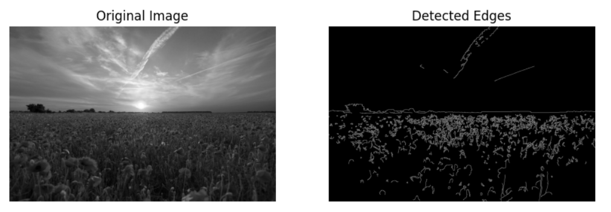

# Canny Edge Detection using Python and OpenCV
### Name: Starbiya S
### Reg no: 212223040208
## Aim
To implement the Canny Edge Detection algorithm on a sample image using Python and OpenCV in order to detect and analyze the edges present in the image.

---

# Algorithm

1. Import the required libraries such as OpenCV and Matplotlib.
2. Read the input image in grayscale format.
3. Apply Gaussian Blur to reduce noise in the image.
4. Use the Canny Edge Detection algorithm with suitable threshold values.
5. Display the original image and the detected edge image.
6. Observe and analyze the detected edges.
7. Change the threshold parameters and study their impact on the output.

---

# Program

```python
import cv2
import matplotlib.pyplot as plt

img = cv2.imread('flower.jpg', cv2.IMREAD_GRAYSCALE)

if img is None:
    print("Error: Could not load image. Check file path and filename.")
else:
    blurred = cv2.GaussianBlur(img, (5,5), 0)
    edges = cv2.Canny(blurred, 50, 150)

    plt.figure(figsize=(10,5))

    plt.subplot(121)
    plt.imshow(img, cmap='gray')
    plt.title('Original Image')
    plt.axis('off')

    plt.subplot(122)
    plt.imshow(edges, cmap='gray')
    plt.title('Detected Edges')
    plt.axis('off')

    plt.show()
```

---

# Output



---

# Result

The Canny Edge Detection algorithm was successfully implemented using Python and OpenCV. The detected edges clearly highlight the boundaries and important structures present in the image. The algorithm effectively removes noise and preserves meaningful edges.

---

# Discussion on Detected Edges

- The detected edges represent sharp intensity changes in the image.
- Strong object boundaries are clearly visible.
- Gaussian Blur helps in reducing noise before edge detection.
- The Canny algorithm provides accurate and thin edges compared to other edge detection methods.

---

# Impact of Different Parameter Settings on the Result

The performance of the Canny Edge Detector mainly depends on the threshold values used.

---

## 1. Low Threshold Values

### Example

```python
edges = cv2.Canny(blurred, 50, 100)
```

### Impact

- Detects more edges.
- Sensitive to image noise.
- Produces extra unwanted edges.
- Useful when fine details are required.

---

## 2. High Threshold Values

### Example

```python
edges = cv2.Canny(blurred, 150, 250)
```

### Impact

- Detects only strong edges.
- Removes weak and noisy edges.
- Some important details may be lost.
- Produces cleaner edge output.

---

## 3. Moderate Threshold Values

### Example

```python
edges = cv2.Canny(blurred, 100, 200)
```

### Impact

- Provides balanced edge detection.
- Preserves important edges while reducing noise.
- Commonly used for general applications.

---

# Conclusion

Canny Edge Detection is an efficient and widely used edge detection technique in image processing. By adjusting the threshold values, the number and quality of detected edges can be controlled effectively. The experiment demonstrates how Canny Edge Detection helps in identifying object boundaries and structural details in digital images.